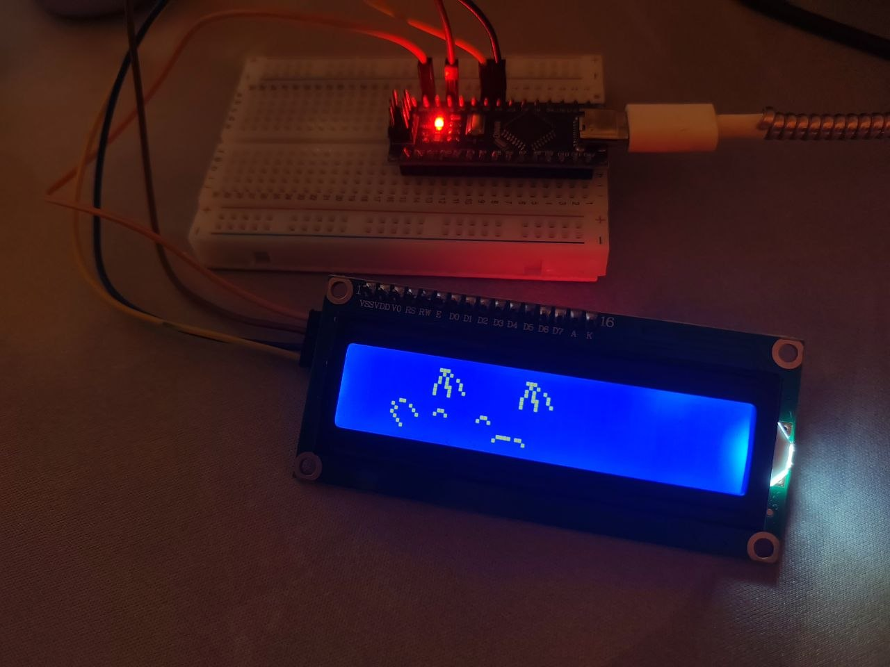

# Keycat

## Description

Bongo cat for your small monitor)

## Arduino nano connections

- GND (i2c) -> GND (nano)
- VCC -> 5V
- SDA -> A4
- SCL -> A5

## Try

1. clone repo

```
git clone https://github.com/ox1s/keycat.git
```

2. to dir

```
cd keycat/src
```

3. run

```
dotnet run .\Serial.cs
```


